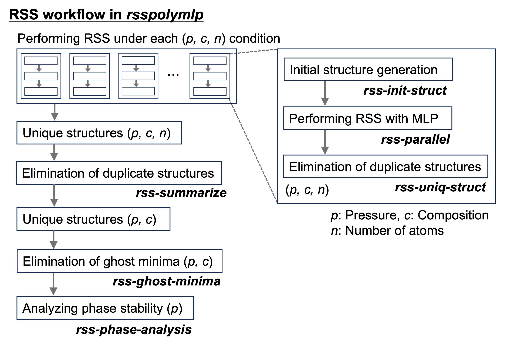

# Workflow of RSS with polynomial MLPs

## Overview



## Command-Line Interface: `rsspolymlp`

### Steps 1–3: Perform RSS for each condition defined by pressure (`p`), composition (`c`), and number of atoms (`n`)

#### 1. Generate initial random structures

```shell
rsspolymlp --init_struct --elements Al Cu --atom_counts 4 4 --n_init_str 2000
```

#### 2. Perform parallel geometry optimization using the polynomial MLP

```shell
rsspolymlp --rss_parallel --pot polymlp.yaml --pressure 0.0 --n_opt_str 1000
```

**Note:**
Parallel execution uses `joblib` by default. Alternatively, you can specify `--parallel_method srun` for execution with `srun`, which is more suitable for high-performance computing environments.
In this case, a script named `multiprocess.sh` will be automatically generated and can be executed as follows:

```bash
rsspolymlp --rss_parallel --parallel_method srun --pot polymlp.yaml --pressure 0.0 --n_opt_str 1000
srun -n $SLURM_CPUS_ON_NODE ./multiprocess.sh
```

#### 3. Eliminate duplicate structures

This step processes the optimized structures by:

* Parsing optimization logs, filtering out failed or unconverged cases, and generating computational summaries
* Removing duplicates and extracting unique optimized structures

```shell
rsspolymlp --uniq_struct
```

#### Run Steps 1–3 all at once

These three steps can also be performed with a single command using the `--rss_full` option:

```shell
rsspolymlp --rss_full --elements Al Cu --atom_counts 4 4 --pot polymlp.yaml --pressure 0.0 --n_opt_str 1000
```

---

### Steps 4–6: Analyze RSS results aggregated for each (`p`, `c`) condition

#### 4. Identify unique structures across atom counts `n`

```shell
rsspolymlp --summarize --paths <rss_directory>/*/rss_result/rss_results.json
# <rss_directory>: parent directory containing RSS runs at the same pressure
```

#### 5. Eliminate ghost minima

Ghost minimum structures are identified and filtered based on nearest-neighbor distances.

```shell
cd <summary_dir>
rsspolymlp --ghost_minima --paths ./json/*.json
rsspolymlp --ghost_minima --compare_dft --paths ./ghost_minima_dft
# <summary_dir>: output directory from rss-summarize, storing aggregated RSS results
```

#### 6. Perform phase stability analysis

This step computes relative or formation energies of the RSS-obtained structures, extracts global minima, and identifies metastable structures near the convex hull within a specified energy threshold (e.g., 30 meV/atom).

```shell
rsspolymlp --phase_analysis --elements Al Cu --paths ./*.json \
  --thresholds 10 30 50 \
  --ghost_minima_file ghost_minima/ghost_minima_detection.yaml
```

---

#### 7. (Optional) Visualize RSS Results

Visualize the energy distribution of structures obtained via the RSS workflow:

```shell
rsspolymlp-plot --binary --threshold 30
```
