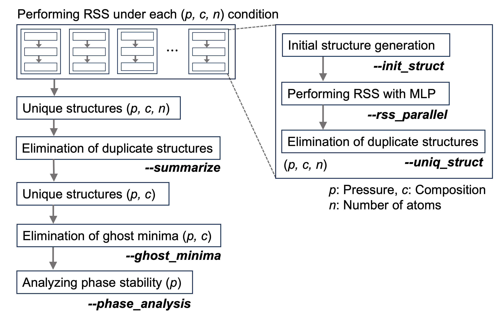

# Workflow of RSS with polynomial MLPs

### Overview


### The command-line interface of `rsspolymlp`

First, RSS using the polynomial MLP is independently performed for each condition defined by pressure (`p`), composition (`c`), and number of atoms (`n`).

1. Generating initial random structures
   
   ```shell
   rsspolymlp --init_struct --elements Al Cu --atom_counts 4 4 --num_init_str 2000
   ```

2. Performing parallel geometry optimization using the polynomial MLP
   
   ```shell
   rsspolymlp --rss_parallel --pot polymlp.yaml --pressure 0.0 --num_opt_str 1000
   ```

3. Eliminating duplicate structures
   
   This step processes the optimized structures. It includes:

   * Parsing optimization logs, filtering out failed or unconverged cases, and generating detailed computational summaries.
   * Removing duplicate structures and extracting unique optimized structures.

   ```shell
   rsspolymlp --uniq_struct
   ```

Next, RSS results aggregated for each (`p`, `c`) condition are analyzed.

4. Identifying unique structures across atom numbers `n`

   ```shell
   rsspolymlp --summarize --elements Al Cu --paths <rss_directory>/*
   # <rss_directory>: parent directory of RSS runs at the same pressure
   ```

5. Eliminating ghost minimum structures
   
   Identifying and filtering out ghost minimum structures based on nearest-neighbor distance are performed.

   ```shell
   rsspolymlp --ghost_minima --paths <summary_dir>/json/*
   rsspolymlp --ghost_minima --compare_dft --paths <summary_dir>/ghost_minima_dft
   # <summary_dir>: output directory from rss-summarize, storing RSS results
   ```

6. Phase stability analysis

   This step computes the relative or formation energies of structures obtained from the RSS and outputs the global minimum structures. It also identifies metastable structures near the convex hull based on a energy threshold (e.g., 30 meV/atom).

   ```shell
   rsspolymlp --phase_analysis --elements Al Cu --paths <summary_dir>/json/* 
   --thresholds 10 30 50 --ghost_minima_file <summary_dir>/ghost_minima/ghost_minima_detection.yaml
   ```

7. (Optional) Plotting RSS results (e.g., `rsspolymlp-plot --binary`)
   
   The energy distribution of structures obtained through this RSS workflow is visualized.
   ```shell
   rsspolymlp-plot --binary --elements Al Cu --threshold 30
   ```